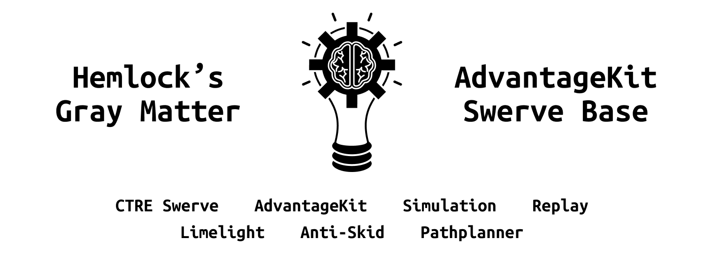

<!--- Version badges. Will automatically pull the latest version from main branch. --->
<p align="center">


</p>

This is a full featured template repository designed to make setting up a new robot as easy as possible. We use the Phoenix 6 Swerve library to provide top of the line drivetrain responsiveness, along with the new [PathPlanner setpoint generation API](https://pathplanner.dev/pplib-swerve-setpoint-generator.html) (based on a version created by team 254) to prevent skidding and wheel slipping.

This template comes with full simulation and replay support built in, which allow you to program the robot, without even having the robot finished yet. More information on replay usage can be found on the [AdvantageKit documentation website](https://docs.advantagekit.org/getting-started/traditional-replay).

> Running the simulator on a fresh version of the code will give you a drivable robot, even without following any steps past step 1 in the "Use the template" section

# Setup

All of the documentation needed for setup and more can be found [on our documentation site](https://hemlock5712.github.io/Swerve-Setup/talonfx-swerve-setup.html).

### Download dependencies

1. Either make a new repository with the "Use this template" button, fork this repository, or just download the zip file.

[](https://github.com/new?template_name=2025SwerveTemplate&template_owner=Hemlock5712)

2. Download [WPILib](https://docs.wpilib.org/en/stable/docs/zero-to-robot/step-2/wpilib-setup.html)
3. Download the [FRC Game Tools](https://docs.wpilib.org/en/stable/docs/zero-to-robot/step-2/frc-game-tools.html)
4. Download [Tuner X](https://github.com/CrossTheRoadElec/Phoenix-Releases/releases)

### Use the template

1. Clone the repository you made (or open the downloaded version) and open it in WPILib VSCode.
2. Run the `WPILib: Set Team Number` task from the WPILib icon in the VSCode toolbar and set your team number.
3. Connect to your robot
4. Open Tuner X (run the temporary diagnostic server if your RoboRIO doesn't have code yet)
5. Follow the swerve setup guide in the mechanisms tab
6. In the final step of the swerve setup, choose the `Generate only TunerConstants` option and overwrite the file at `src/main/java/frc/robot/generated/TunerConstants.java`.
7. Inside the TunerConstants.java file, change the last import and the last method in the file
```diff
- import frc.robot.subsystems.CommandSwerveDrivetrain;
+ import frc.robot.subsystems.drive.DriveIOCTRE;
```

```diff
- public static CommandSwerveDrivetrain createDrivetrain() {
-     return new CommandSwerveDrivetrain(
-         DrivetrainConstants, FrontLeft, FrontRight, BackLeft, BackRight
-     );
- }
+ public static DriveIOCTRE createDrivetrain() {
+     return new DriveIOCTRE(
+         DrivetrainConstants,
+         FrontLeft, FrontRight, BackLeft, BackRight
+     );
+ }
```

If you followed all of these steps, your robot should be drivable now!

You can improve your driving experience drastically by following the steps [in this guide](https://hemlock5712.github.io/Swerve-Setup/talonfx-swerve-tuning.html). Make sure you tune your drivetrain again after your robot is assembled, since adding weight to your robot will change a lot of physical properties of how it will act.

## Having issues?

Feel free to create a GitHub issue and we'll try to help out as quickly as possible.
